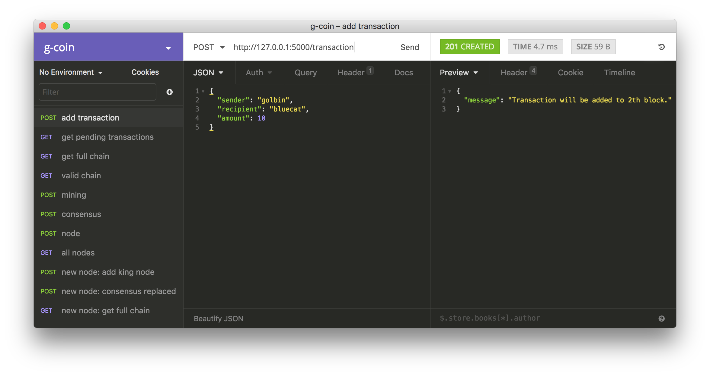
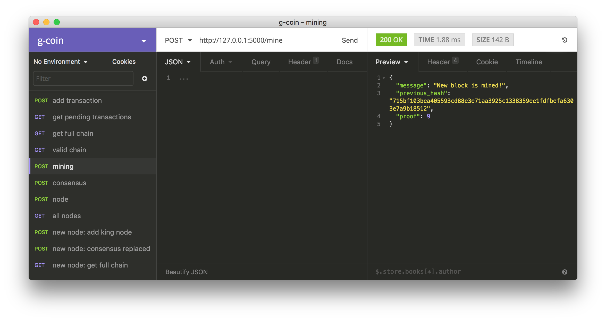

# G Coin

A simple implementation of Blockchain for understanding easily.

It includes only basic concepts.

- Block and Hash
- Transaction and Balance
- Mining with Proof of Work
- Chain validation and consensus conflicts

Articles (Korean)

※ 아래 글은 최신 버전의 코드가 반영되어 있지 않습니다. 참고해주세요.

- [골빈해커님의 g-coin 분석 1부](https://tykimos.github.io/2018/01/21/g_coin_analysis_part1)
- [골빈해커님의 g-coin 분석 2부](https://tykimos.github.io/2018/01/21/g_coin_analysis_part2)
- 골빈해커님의 g-coin 분석 3부 (Comming soon)

## Modules

**bold** is core function.

- blockchain : chain structure /w blocks
    - **new_block**: make block /w hash of previous block and current proof
    - **valid**: validate chain rules of all chain
- block : block structure
    - **hash**: hash itself
- proof : proof of work
    - **find_proof**
    - **valid_proof**
- miner : Mining new block and get rewards
- transaction : data object
- book : book of transactions
    - **check_balance** /w transaction history of sender account
- node
    - **consensus_with_neighbor**

## Endpoints

- `/transaction` : Add a transaction and get pending transactions.
- `/mine` : Mining. Find proof and make block with rewards.
- `/node` : Add a node as a neighbor node
- `/chain` : Get full chain to validate.
- `/chain/valid` : Valid chain
- `/chain/consensus` : Consensus conflicts

## Basic Flow

- `/transaction`: Add trasaction for sending coin.
    - Check balance and add to blockchain
    - Use '0' as a sender id at the first time. It's the genesis wallet.
- `/mine`: Mining for making block.
    - Find proof with previous proof
    - Add a reward to transactions
    - Make a new block with proof and hash of previous block
    - Add the block to chain of blocks
    - Clear current transactions
- `/chain/consensus`: Consensus conflicts with neighbor nodes.
    - Fetch blockchain from all neighbor nodes.
    - Check which has the longest chain and valiates it's chain.
    - Add neighbor nodes before do this using `/node`

### Try using Insomnia

- Download [Insomnia](https://insomnia.rest/)
- Import from insomnia.json




### Mining practice

```bash
python app.py --port 5000
```

- First try
    - POST `/transaction`
        - /w {sender: '0', recipient: 'golbin', amount: 10}
    - GET `/transaction`
    - GET `/chain`
    - POST `/mine`
    - GET `/chain`
    - GET `/transaction`
- Second try
    - POST `/transaction`
        - /w {sender: 'golbin', recipient: 'bluecat', amount: 10}
    - POST `/transaction`
        - /w {sender: 'golbin', recipient: 'bluecat', amount: 10}
    - POST `/mine`
    - GET `/chain`

### Consensus practice

```bash
python app.py --port 5000
python app.py --port 5001
```

- POST `/node`
    - to 127.0.0.1:5000 /w {address: '127.0.0.1:5001'}
- POST `/node`
    - to 127.0.0.1: 5001 /w {address: '127.0.0.1:5000'}
- Try several mining
- GET `/chain/valid`
- POST `/chain/consensus`

## Requirements

- Python >= 3.6
- Flask >= 0.12
- Requests >= 2.18

## TODO

- [ ] Merkle root implementation
- [ ] Check balance in transactions in next blocks
- [ ] Fix balance of genesis account
- [ ] Broadcast transactions
- [ ] Use DB

## References

- http://ecomunsing.com/build-your-own-blockchain
- https://hackernoon.com/learn-blockchains-by-building-one-117428612f46
